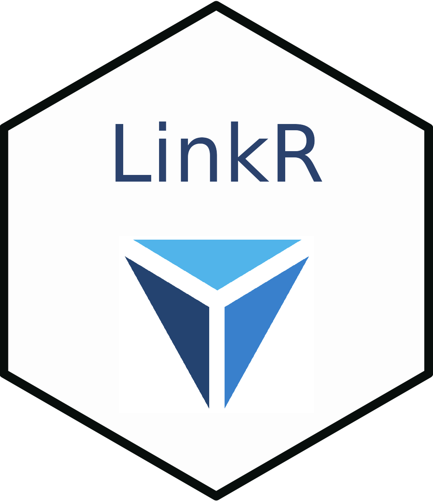
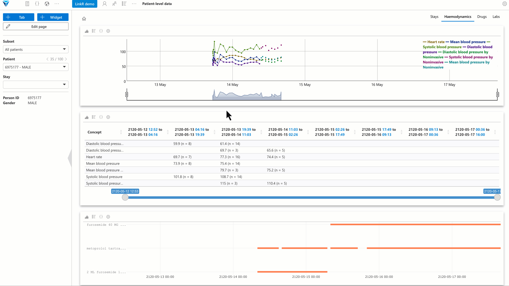
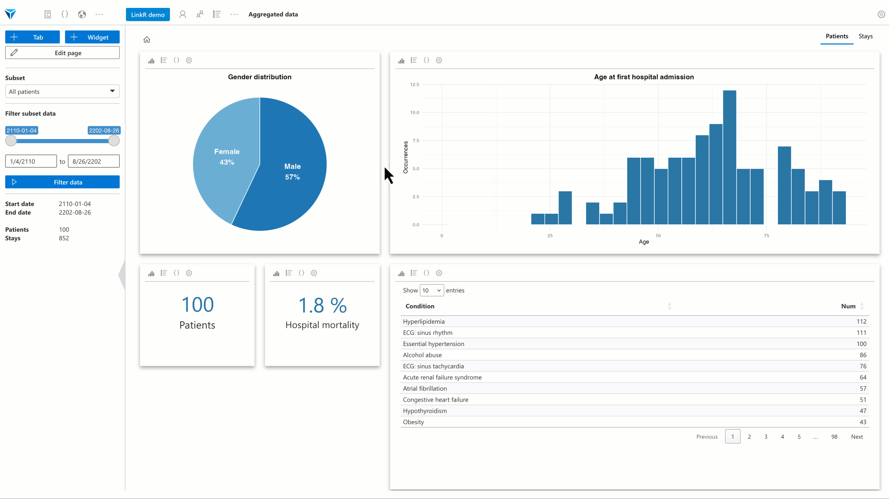
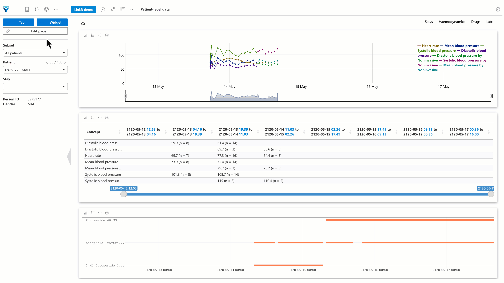

<!-- README.md is generated from README.Rmd. Please edit that file -->

# LinkR <a href="https://linkr.interhop.org/"></a>


## Introduction

**LinkR** is a web application that allows for visualization and
analysis of healthcare data.

The application is coded in R using the Shiny library. It uses the
common data model
<a href = "https://ohdsi.github.io/CommonDataModel/" target = "_blank">OMOP</a>.

## Who is the application for?

The application is for:

- **healthcare professionals**, an intuitive interface allows healthcare
  professionals to analyze data and conduct research projects without
  advanced programming knowledge
- **data scientists and statisticians**, LinkR provides access to a full
  R and Python environment, allowing data scientists and statisticians
  to exploit all the features of advanced data analysis

Thus, LinkR facilitates **collaborative work**.

## Quick overview

Below are some of the key features that make LinkR a **powerful tool**
for **healthcare data analysis**.

#### Organize your data yourself

Easily create a **custom patient record** tailored to the specific needs
of your research project.<br /> As you switch between patients, the
figures **dynamically update** to reflect each patient’s specific data.

<br /> <a href="inst/www/img/patient_level_data.gif">

</a> <br /><br />

#### Create interactive dashboards

Create **customized dashboards** to easily explore your data.<br /> Use
an intuitive **graphical interface** to **visualize aggregated patient
data**.<br /> **Generate** and, if required, **modify** the
corresponding R or Python **code** directly from the figures you create.

<br /> <a href="inst/www/img/aggregated_data.gif">

</a> <br /><br />

#### An intuitive graphical interface

Organize your projects into tabs. Decide which data to display and in
what format.

*“I’d like to display respiratory rate and saturation as a timeline”*

<br /> <a href="inst/www/img/create_tab_and_widget.gif">

</a> <br /><br />

## Sharing and open science

LinkR is an **open source** application.

It contributes to **open science** by allowing the sharing of:

- *projects*: import and export your projects in one click, reproduce
  projects with your own data
- *scripts*: share interoperable scripts, thanks to the use of the
  common OMOP data model
- *plugins*: help improve the application by creating plugins and
  sharing them

## Installation

The `remotes` library must be installed, you can install it with:

``` r
install.packages("remotes")
```

You can install the development version from Framagit, with:

``` r
remotes::install_gitlab("interhop/linkr/linkr", host = "framagit.org")
```

**IMPORTANT**: The application requires version 0.3.0 of shiny.fluent.
By default, version 0.4.0 is installed, which has unresolved bugs.

You can install version 0.3.0 with:

``` r
remotes::install_github('Appsilon/shiny.fluent', ref = 'dd1c956')
```

## Launch the app

To launch the Shiny app, run:

``` r
linkr::linkr(language = "en")
```

See `?linkr::linkr` for more informations.

Visit
<a href="https://linkr.interhop.org/en/docs/installation/" target="_blank">our
website</a> for further details.

## Contributions

LinkR thrives on community support to grow and improve! You can
contribute by developing plugins, enhancing the application’s codebase,
or reporting bugs to help us maintain and refine the application.

**Tackle open issues**: Join us in addressing challenges by visiting our
<a href="https://framagit.org/interhop/linkr/linkr/-/issues" target="_blank">issue
tracker</a>.

**Report bugs**: If you encounter a bug, please let us know by creating
a detailed report on the
<a href="https://framagit.org/interhop/linkr/linkr/-/issues" target="_blank">issue
tracker</a>.

## Support us

LinkR is supported by the **Interhop association**, which advocates for
**open-source solutions** and **interoperability** in healthcare.

You can help advance open science in healthcare by contributing to
LinkR’s development. Consider
<a href="https://interhop.org/en/dons/" target="_blank">making a
donation</a> to support our mission.

## Contact

Email: <linkr-app@pm.me>.
