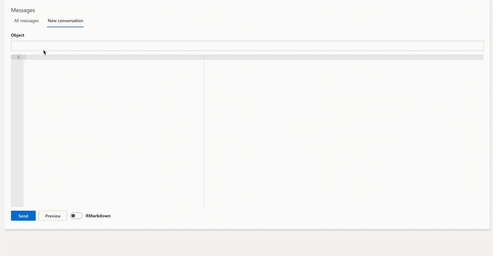

# LinkR <a href="https://framagit.org/interhop/linkr/linkr"></a>


## Introduction

**LinkR** est une application web qui permet la visualisation et l'analyse des données de santé.

L'application est codée en R à l'aide de la bibliothèque Shiny. Elle utilise le modèle de données commun [OMOP](https://ohdsi.github.io/CommonDataModel/).

## A qui s'adresse LinkR ?

L'application est destinée :

- aux **professionnels de santé**, une interface intuitive permet aux professionnels de santé d'analyser des données et de mener des études sans avoir de connaissances avancées en programmation.
- aux **data scientists et statisticiens**, LinkR offre un accès à un environnement complet en R et Python, permettant aux data scientists et statisticiens d'exploiter toutes les fonctionnalités de l'analyse avancée des données.
- **étudiants en santé**, des tutoriels intégrés dans l'application offrent aux étudiants en santé l'opportunité d'apprendre et de pratiquer l'analyse des données dans le domaine de la santé.

Ainsi, LinkR facilite le **travail collaboratif**.

## Aperçu rapide

Utilisez une **interface graphique intuitive** pour **visualiser les données agrégées des patients**. **Générez** et, si nécessaire, **modifiez** le code R correspondant directement à partir des graphiques que vous créez.

<br /><br />

**Explorez les données** patient par patient. En passant d'un patient à l'autre, les graphiques sont **mis à jour dynamiquement** pour refléter les données spécifiques de chaque patient.

<br /><br />

**Améliorez la collaboration en équipe** grâce à notre système de messagerie intégrée. Échangez des messages avec les membres de l'équipe pour vous entraider.



## Partage et open science

LinkR est une **application open source**.

Elle contribue à la **science ouverte** en permettant le partage :

- d'*études* : importez et exportez vos études en un clic, reproduisez des études avec vos propres données.
- de *scripts* : partagez des scripts interopérables, grâce à l'utilisation du modèle de données OMOP commun.
- de *plugins* : contribuez à l'amélioration de l'application en créant des plugins et en les partageant.

## Installation

La bibliothèque `remotes` doit être installée, vous pouvez l'installer avec :

``` r
install.packages("remotes")
```

Vous pouvez installer la version de développement depuis Framagit, avec :

``` r
remotes::install_gitlab("interhop/linkr/linkr", host = "framagit.org")
```

## Lancer l'application

Pour lancer l'application Shiny, exécutez :

``` r
linkr::linkr(language = "fr")
```

Vous pouvez utiliser les arguments suivants dans la fonction linkr :

- *language* : choisissez dans quelle langue l'application sera lancée ; “en” et “fr” sont disponibles.
- *app_folder* : par défaut, les fichiers de l'application sont enregistrés dans le dossier principal (path.expand("~") pour connaître le dossier). Vous pouvez changer ce dossier en spécifiant le dossier cible dans cet argument.
- *local* : TRUE ou FALSE pour permettre à l'application d'accéder à Internet.
- *show_home_page* : TRUE ou FALSE pour afficher les pages d'accueil (vue d'ensemble, actualités, tutoriels…).

Consultez `?linkr::linkr` pour plus d'informations.

Le premier chargement peut prendre quelques minutes pour créer la base de données de l'application et télécharger les données par défaut.

Utilisez "admin" comme **identifiant et mot de passe** pour votre première connexion.

## Contributions

LinkR a **besoin d'aide** pour évoluer ! Vous pouvez contribuer en créant des plugins ou en aidant à améliorer le code de l'application.

## Signaler un bug

<a href = "https://framagit.org/interhop/linkr/linkr/-/issues" target = "_blank">Rendez-vous ici</a> pour signaler un bug.

## Soutenez-nous

LinkR est soutenu par l'association **Interhop**, qui promeut l'open source et l'interopérabilité dans le domaine de la santé.

Vous pouvez **<a href = "https://interhop.org/en/dons/" target = "_blank">faire un don ici</a>**.

## Contact

Email: <linkr-app@pm.me>.
